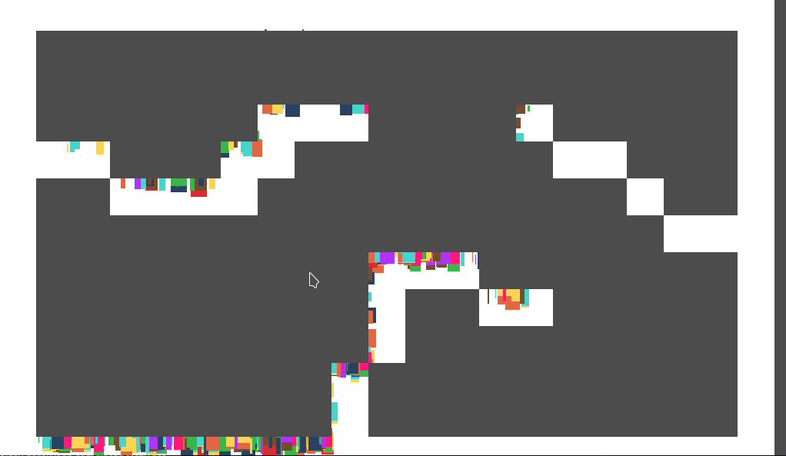

# Godot Color Splatter Effect
Cool color splatter effect for godot 

## How to use

Check out `src/Example` for working examples.

### Steps

1. Add `SplatLayer.tscn` scene under TileMap Node. 
2. Add `ParticleCollider` scene under particle Node. 
3. Connect `particle_collided` and use `draw_spot_at_collision` to draw spot on collision.
